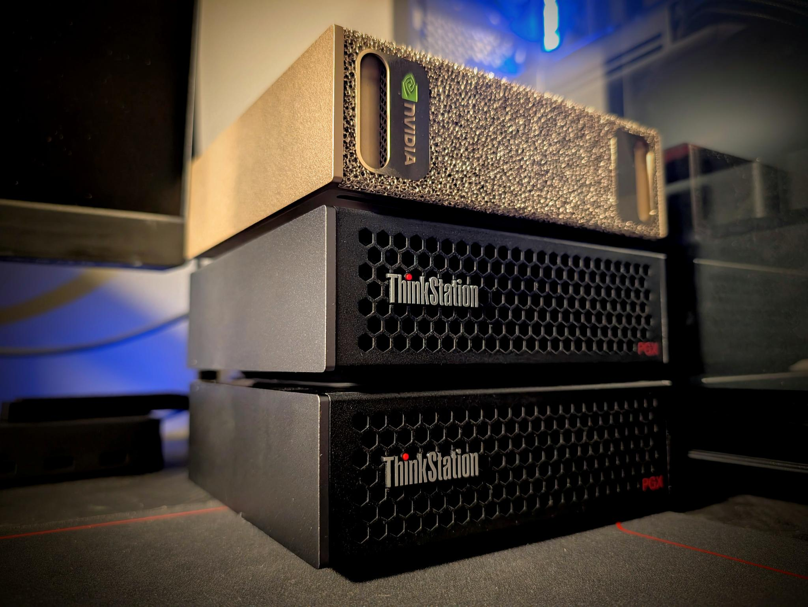
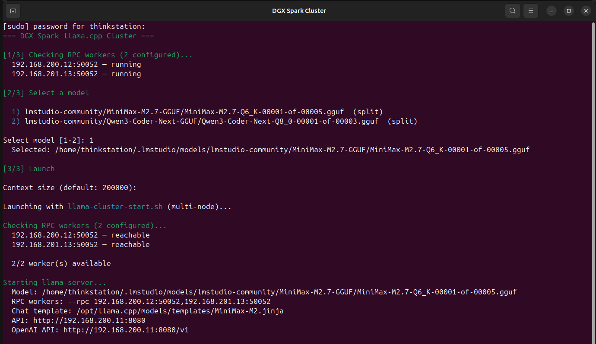
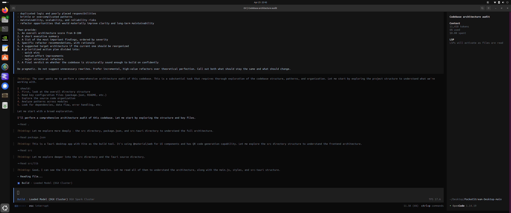
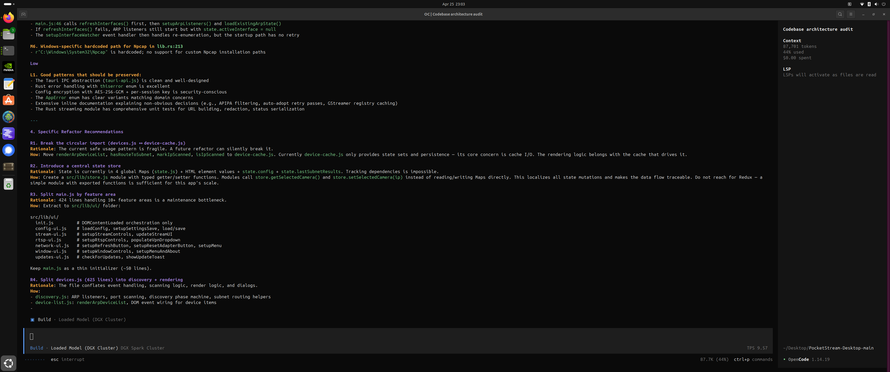
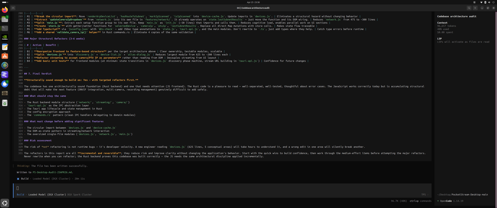

# DGX Llama Cluster — Triple Decker Edition

Three NVIDIA DGX Spark nodes wired in a star topology over ConnectX-7 RDMA, running [llama.cpp](https://github.com/ggml-org/llama.cpp) with CUDA acceleration to serve 400B+ parameter models from a single OpenAI-compatible HTTP endpoint.

<p align="center">
  
</p>

## Architecture

Three DGX Spark nodes stacked into one logical inference cluster. **Node 1** (top) is the head — it runs `llama-server`, exposes the OpenAI-compatible HTTP API, and orchestrates the workers. **Nodes 2 and 3** each run `rpc-server` and contribute their full 128 GB of unified memory to the model.

**Network — star topology, no switch:**

```
                 ┌───────────────────────────────────┐
                 │  Node 1  (Head — llama-server)    │
                 │  192.168.200.11 / 192.168.201.11  │
                 └─────────┬───────────────┬─────────┘
              port A → :200/24       port B → :201/24
                           │               │
              ┌────────────┴───┐   ┌───────┴────────┐
              │  Node 2 (RPC)  │   │  Node 3 (RPC)  │
              │ 192.168.200.12 │   │ 192.168.201.13 │
              └────────────────┘   └────────────────┘
```

Two ConnectX-7 200GbE direct-attach cables, no switch required. Node 1 is the hub; Node 2 hangs off port A on the `192.168.200.0/24` subnet and Node 3 hangs off port B on the `192.168.201.0/24` subnet. The asymmetric subnet for Node 3 is intentional and handled by the setup scripts.

| | Node 1 (Head) | Node 2 (Worker) | Node 3 (Worker) |
|---|---|---|---|
| **Role** | `llama-server` — HTTP API | `rpc-server` — GPU compute | `rpc-server` — GPU compute |
| **GPU** | NVIDIA GB10 — 128 GB | NVIDIA GB10 — 128 GB | NVIDIA GB10 — 128 GB |
| **RDMA IP** | 192.168.200.11 / 192.168.201.11 | 192.168.200.12 | 192.168.201.13 |
| **Key Port** | 8080 (API) | 50052 (RPC) | 50052 (RPC) |

**Total: 384 GB unified memory** — enough to load 400B+ parameter models in 4-bit quantization with room for KV cache.

The `ggml-rpc` backend in llama.cpp uses native RDMA when `libibverbs` is detected at build time — auto-negotiated at runtime, no command-line flags. Setup scripts ensure the headers are present so RDMA is enabled by default; if they aren't, the backend transparently falls back to TCP/IP over RoCE. Verify which mode the installed binaries are using with `sudo verify-rdma.sh` (section 8).

## Quick Start

Run the same script trio on each node, in order. Each script prints the next command when it finishes, so you can follow the chain.

### 1. Edit Configuration

All IPs, ports, and node count live in one file:

```bash
nano cluster.conf
```

Defaults already match the diagram above (`NODE_COUNT=3`, star topology). Adjust IPs only if your network differs.

### 2. Reset (Optional — Fresh Start)

If you have a previous installation on this node, clean it first:

```bash
sudo ./reset.sh
# Reboot
```

### 3. Run the Per-Node Chain

On **Node 1** (head):

```bash
sudo ./setup-rdma.sh   --node 1     # configures ConnectX-7, reboots
sudo ./setup-llama.sh  --node 1     # builds llama.cpp, installs launchers
sudo ./setup-models.sh --node 1     # NFS server — exports models to workers
./install-launcher.sh               # optional — desktop icon (no sudo)
```

On **Node 2** (worker):

```bash
sudo ./setup-rdma.sh   --node 2     # reboot
sudo ./setup-llama.sh  --node 2     # installs rpc-server service
sudo ./setup-models.sh --node 2     # NFS client — mounts models from Node 1
```

On **Node 3** (worker):

```bash
sudo ./setup-rdma.sh   --node 3     # reboot
sudo ./setup-llama.sh  --node 3
sudo ./setup-models.sh --node 3
```

That's it. Verify RDMA on any node with `sudo verify-rdma.sh`.

### 4. Launch a Model

On Node 1:

```bash
# Interactive (recommended — checks all workers, lists models)
sudo start-everything.sh

# Or directly (auto-detects reachable workers)
sudo llama-cluster-start.sh ~/.lmstudio/models/<org>/<model>/<file>.gguf
```

Models go in `~/.lmstudio/models` on Node 1 and are auto-shared via NFS:

```bash
cd ~/.lmstudio/models
huggingface-cli download <org>/<model> --include '*Q4_K_M*' --local-dir .
```

## In Action

End-to-end run on the cluster — `start-everything.sh` boots the model across all three nodes, then opencode drives a 20-minute architecture audit of an external Tauri/Rust codebase against the local OpenAI-compatible API.

**1. Launching the cluster** — `start-everything.sh` checks each worker, lists local GGUF models, and starts `llama-server` with the right `--rpc` endpoints and chat template auto-discovered.

<p align="center">
  
</p>

**2. Agent connects** — opencode (1.14.19) talks to `http://192.168.200.11:8080/v1` and MiniMax-M2 starts walking the target codebase one tool call at a time.

<p align="center">
  
</p>

**3. Mid-audit** — the model is producing concrete refactor recommendations with rationale and file/line references. ~88K tokens in, ~44% of the 200K context used.

<p align="center">
  
</p>

**4. Done** — 20m 11s wall-clock, 96.7K tokens, full audit written to `PS-Desktop-Audit-25APR26.md`.

<p align="center">
  
</p>

## Desktop Launcher (optional)

For one-click access from the GNOME desktop on Node 1:

```bash
./install-launcher.sh        # no sudo — installs under ~/.local/share/
```

This generates icons at 256/128/64/48 px, drops a `.desktop` file on your desktop and in `~/.local/share/applications/`, and pins it to the GNOME dock. Clicking the icon opens a terminal and runs `sudo start-everything.sh` — the same interactive launcher used above.

If the desktop icon shows a gear overlay (GNOME's "Untrusted Application" state), right-click → **Allow Launching** to trust it. The dock icon may need a logout/login the first time it appears.

To remove later:

```bash
./install-launcher.sh --remove
```

Requires `start-everything.sh` to already be installed (handled by `setup-llama.sh --node 1`) and Python Pillow for icon generation (auto-installed if missing).

## Hot-Plugging Node 3

Node 3 is portable — pull its cable and the cluster keeps running on Node 1 + Node 2 (256 GB total) without any reconfiguration. The launcher's worker-discovery step skips unreachable RPC endpoints automatically. Plug Node 3 back in and re-launch to bring 384 GB back online.

## Project Structure

```
├── cluster.conf          # Central config — IPs, ports, node count, llama.cpp pin
├── lib/common.sh         # Shared bash functions
├── setup-rdma.sh         # ConnectX-7 RDMA setup (--node N)
├── setup-llama.sh        # llama.cpp build & install (--node N)
├── setup-models.sh       # NFS model sharing (--node N)
├── reset.sh              # Clean slate — removes all cluster components
├── install-launcher.sh   # GNOME desktop launcher (Node 1 only)
├── assets/               # Icons and images
└── README.md
```

**Key design decisions:**
- All configuration in `cluster.conf` — change IPs once, not in N files
- Common functions in `lib/common.sh` — no code duplication
- Unified scripts with `--node N` flag — same script for all nodes
- Star topology with Node 1 as hub — no switch required, two cables total
- `reset.sh` for clean restarts — removes services, configs, binaries

## Installed Components

After running all setup scripts, these are deployed on the system:

| Path | Purpose |
|---|---|
| `/usr/local/bin/llama-server` | HTTP API server (OpenAI-compatible) |
| `/usr/local/bin/rpc-server` | RPC worker for distributed inference |
| `/usr/local/bin/llama-cli` | CLI inference tool |
| `/usr/local/bin/start-everything.sh` | Interactive cluster launcher |
| `/usr/local/bin/llama-cluster-start.sh` | Multi-node launcher (auto-detects workers) |
| `/usr/local/bin/llama-local-start.sh` | Single-node launcher |
| `/usr/local/bin/cluster-status.sh` | Cluster health check (all workers) |
| `/usr/local/bin/cluster-stop.sh` | Stop server/worker |
| `/usr/local/bin/verify-rdma.sh` | RDMA verification |
| `/etc/systemd/system/llama-rpc.service` | RPC worker auto-start (worker nodes) |
| `/etc/systemd/system/rdma-qos.service` | RDMA QoS on boot |
| `/etc/netplan/60-rdma-connectx7.yaml` | RDMA network config |
| `/opt/llama.cpp/` | Source build directory |

## API Usage

Once running, the server exposes an OpenAI-compatible API:

```bash
# Health check
curl http://192.168.200.11:8080/health

# List models
curl http://192.168.200.11:8080/v1/models

# Chat completion
curl http://192.168.200.11:8080/v1/chat/completions \
  -H "Content-Type: application/json" \
  -d '{
    "messages": [{"role": "user", "content": "Hello!"}],
    "temperature": 0.7
  }'
```

Works with any OpenAI-compatible client — just point it at `http://192.168.200.11:8080/v1`.

## Cluster Management

```bash
# Check status (shows all workers)
cluster-status.sh

# Stop server (Node 1)
cluster-stop.sh

# Stop everything
stop-everything.sh

# Verify RDMA
sudo verify-rdma.sh

# Test RDMA bandwidth
# On one node:
sudo rdma-test-server.sh
# On the other:
sudo rdma-test-client.sh
```

## Models

Models are stored in `~/.lmstudio/models` (shared with LM Studio). Node 1 exports this directory via NFS so all workers can access the same files.

Download models using Hugging Face CLI or LM Studio:

```bash
# Example: download a quantized model
cd ~/.lmstudio/models
huggingface-cli download <org>/<model> --include '*Q4_K_M*' --local-dir .
```

Both single-file (`.gguf`) and split models (`*-00001-of-*.gguf`) are supported.

## Troubleshooting

### "Activation of network failed" pop-ups on Node 1

If your DGX Spark has onboard NICs alongside the ConnectX-7 ports, NetworkManager may keep trying to DHCP those unused interfaces and surface a recurring "activation of network failed" notification. The cluster doesn't use those ports, so just disable autoconnect on their NM profiles:

```bash
nmcli -t -f NAME,DEVICE connection show | grep -i wired   # find the offending profiles
sudo nmcli connection modify "Wired connection 1" connection.autoconnect no
sudo nmcli connection down   "Wired connection 1"
# repeat for any other phantom profile
```

Fully reversible — flip `autoconnect` back to `yes` if you ever cable those ports up.

### MiniMax tool calls fail with HTTP 500 / "Failed to parse input"

Agents that fan out into parallel tool calls (e.g. opencode auditing a codebase) cause MiniMax-M2 to emit multiple `<invoke>` elements inside one `<minimax:tool_call>` block. llama.cpp ≥ commit `134d6e54d` (PR #20690, Apr 22 2026, "common/chat, server: refactor") fails to parse this and returns HTTP 500.

`cluster.conf` ships with `LLAMA_CPP_COMMIT="ca7f7b7b9"` pinned to the last commit before that refactor — still includes native RDMA (Apr 15) and the earlier MiniMax single-call fix (Apr 8).

**Tested working:** llama.cpp `ca7f7b7b9` + opencode `1.14.19`. Bump the pin only after confirming the upstream regression is fixed (quickest test: send a request prompting MiniMax to read several files at once and verify llama-server returns a proper `tool_calls` JSON).

## Requirements

- 3× NVIDIA DGX Spark (GB10, 128 GB unified memory each)
- ConnectX-7 200GbE NICs — two direct-attach cables from Node 1 to each worker
- DGX OS (NVIDIA's customized Ubuntu 24.04, aarch64)
- CUDA toolkit 13+
- MLNX OFED drivers
