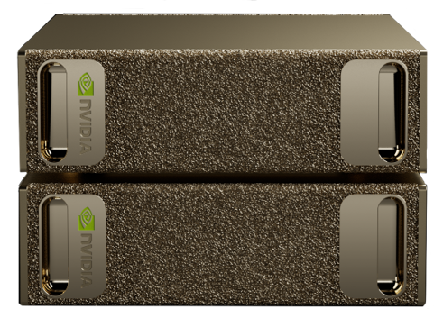

# DGX Spark Llama Cluster

Distributed LLM inference across NVIDIA DGX Spark nodes using [llama.cpp](https://github.com/ggml-org/llama.cpp) with CUDA GPU acceleration and RDMA networking.

<p align="center">
  
</p>

## Architecture

The cluster scales from 2 to N nodes. Node 1 is the head (runs `llama-server`), all other nodes are workers (run `rpc-server`).

| | Node 1 (Head) | Node 2+ (Workers) |
|---|---|---|
| **Role** | `llama-server` — HTTP API | `rpc-server` — GPU compute |
| **GPU** | NVIDIA GB10 — 128 GB unified memory | NVIDIA GB10 — 128 GB unified memory each |
| **RDMA IP** | 192.168.200.11 / .201.11 | 192.168.200.1x / .201.1x |
| **Key Port** | 8080 (API) | 50052 (RPC) |

| Nodes | Total VRAM | Model Size |
|---|---|---|
| 2 | 256 GB | 200B+ parameters |
| 3 | 384 GB | 400B+ parameters |
| 4 | 512 GB | 600B+ parameters |

Nodes connect via ConnectX-7 200GbE with RoCE (RDMA over Converged Ethernet). The `ggml-rpc` backend in llama.cpp uses native RDMA when `libibverbs` is detected at build time — auto-negotiated at runtime, no command-line flags. Setup scripts ensure the headers are present so RDMA is enabled by default; if they aren't, the backend transparently falls back to TCP/IP over RoCE. Verify which mode the installed binaries are using with `sudo verify-rdma.sh` (section 8).

## Quick Start

Each node follows the same sequential flow. Each script tells you the next command to run on that node when it finishes, so you can just follow the chain.

### 1. Edit Configuration

All IPs, ports, and node count live in one file. To add a third node, uncomment `NODE3_IP` / `NODE3_IP2` and set `NODE_COUNT=3`:

```bash
nano cluster.conf
```

### 2. Reset (Optional — Fresh Start)

If you have a previous installation on this node, clean it first:

```bash
sudo ./reset.sh
# Reboot
```

### 3. Run the Per-Node Chain

On **Node 1** (head):

```bash
sudo ./setup-rdma.sh   --node 1     # configures ConnectX-7, reboots
sudo ./setup-llama.sh  --node 1     # builds llama.cpp, installs launchers
sudo ./setup-models.sh --node 1     # NFS server — exports models to workers
./install-launcher.sh               # optional — desktop icon (no sudo)
```

On **each worker node** (2, 3, …):

```bash
sudo ./setup-rdma.sh   --node <N>   # configures ConnectX-7, reboots
sudo ./setup-llama.sh  --node <N>   # builds llama.cpp, installs rpc-server service
sudo ./setup-models.sh --node <N>   # NFS client — mounts models from Node 1
```

That's it. Verify RDMA any time with `sudo verify-rdma.sh`.

### 4. Launch a Model

On Node 1:

```bash
# Interactive (recommended — checks all workers, lists models)
sudo start-everything.sh

# Or directly (auto-detects reachable workers)
sudo llama-cluster-start.sh ~/.lmstudio/models/<org>/<model>/<file>.gguf
```

Models go in `~/.lmstudio/models` on Node 1 and are auto-shared via NFS:

```bash
cd ~/.lmstudio/models
huggingface-cli download <org>/<model> --include '*Q4_K_M*' --local-dir .
```

## Scaling to 3+ Nodes

1. Edit `cluster.conf`:
   ```bash
   NODE_COUNT=3

   NODE3_IP="192.168.200.13"
   NODE3_IP2="192.168.201.13"
   ```

2. On the new node:
   ```bash
   sudo ./setup-rdma.sh --node 3    # reboot
   sudo ./setup-llama.sh --node 3
   sudo ./setup-models.sh --node 3
   ```

3. Re-run on Node 1 to update launch scripts with the new worker:
   ```bash
   sudo ./setup-llama.sh --node 1
   sudo ./setup-models.sh --node 1
   ```

The cluster launcher automatically discovers and connects to all reachable workers.

## Project Structure

```
├── cluster.conf          # Central config — IPs, ports, node count
├── lib/common.sh         # Shared bash functions
├── setup-rdma.sh         # ConnectX-7 RDMA setup (--node N)
├── setup-llama.sh        # llama.cpp build & install (--node N)
├── setup-models.sh       # NFS model sharing (--node N)
├── reset.sh              # Clean slate — removes all cluster components
├── install-launcher.sh   # GNOME desktop launcher (Node 1 only)
├── assets/               # Icons and images
└── README.md
```

**Key design decisions:**
- All configuration in `cluster.conf` — change IPs once, not in N files
- Common functions in `lib/common.sh` — no code duplication
- Unified scripts with `--node N` flag — same script for all nodes
- N-node scalable — add workers by editing one config file
- `reset.sh` for clean restarts — removes services, configs, binaries

## Installed Components

After running all setup scripts, these are deployed on the system:

| Path | Purpose |
|---|---|
| `/usr/local/bin/llama-server` | HTTP API server (OpenAI-compatible) |
| `/usr/local/bin/rpc-server` | RPC worker for distributed inference |
| `/usr/local/bin/llama-cli` | CLI inference tool |
| `/usr/local/bin/start-everything.sh` | Interactive cluster launcher |
| `/usr/local/bin/llama-cluster-start.sh` | Multi-node launcher (auto-detects workers) |
| `/usr/local/bin/llama-local-start.sh` | Single-node launcher |
| `/usr/local/bin/cluster-status.sh` | Cluster health check (all workers) |
| `/usr/local/bin/cluster-stop.sh` | Stop server/worker |
| `/usr/local/bin/verify-rdma.sh` | RDMA verification |
| `/etc/systemd/system/llama-rpc.service` | RPC worker auto-start (worker nodes) |
| `/etc/systemd/system/rdma-qos.service` | RDMA QoS on boot |
| `/etc/netplan/60-rdma-connectx7.yaml` | RDMA network config |
| `/opt/llama.cpp/` | Source build directory |

## API Usage

Once running, the server exposes an OpenAI-compatible API:

```bash
# Health check
curl http://192.168.200.11:8080/health

# List models
curl http://192.168.200.11:8080/v1/models

# Chat completion
curl http://192.168.200.11:8080/v1/chat/completions \
  -H "Content-Type: application/json" \
  -d '{
    "messages": [{"role": "user", "content": "Hello!"}],
    "temperature": 0.7
  }'
```

Works with any OpenAI-compatible client — just point it at `http://192.168.200.11:8080/v1`.

## Cluster Management

```bash
# Check status (shows all workers)
cluster-status.sh

# Stop server (Node 1)
cluster-stop.sh

# Stop everything
stop-everything.sh

# Verify RDMA
sudo verify-rdma.sh

# Test RDMA bandwidth
# On one node:
sudo rdma-test-server.sh
# On the other:
sudo rdma-test-client.sh
```

## Models

Models are stored in `~/.lmstudio/models` (shared with LM Studio). Node 1 exports this directory via NFS so all workers can access the same files.

Download models using Hugging Face CLI or LM Studio:

```bash
# Example: download a quantized model
cd ~/.lmstudio/models
huggingface-cli download <org>/<model> --include '*Q4_K_M*' --local-dir .
```

Both single-file (`.gguf`) and split models (`*-00001-of-*.gguf`) are supported.

## Requirements

- 2+ NVIDIA DGX Spark (GB10, 128 GB unified memory each)
- ConnectX-7 200GbE NICs (dual-port, direct-connect or via switch)
- Ubuntu 22.04+ (aarch64)
- CUDA toolkit 13+
- MLNX OFED drivers
